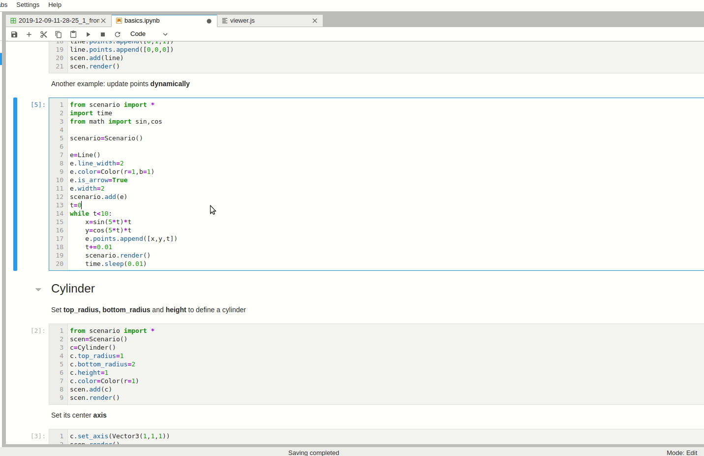

**Scenario** is a python library that helps to build simple environments for simulation of agents.

# Note
I'm now refacing this project, so if you want to use scenario, please checkout tag v0.0.0 for a stable release.
Besides, you can also have a look at the minimum version -- py3d. It's a independed package with classes I seperated from this project. It focusses on dealing with points, lines and planes in batches. And it is also very easy to install, without clone this project, just `pip install py3d -i https://pypi.org/simple`. Its documents locates in [introduction of py3d](py3d/doc/introduction.ipynb) of this project.

Demands wanted! Please tell me you ideas, requirements or suggestions by open issues. I want to hear your voice.
如果你有更好的想法、建议或者需求请通过issue告诉我，我想听到用户的声音。

# Features
☑ Jupyter support\
☑ Kinematics emulate\
☑ Tiny 2D rendering, view from top\
☑ Smooth 3D rendering\
☑ Full control of simulation loop\
☑ No ipc in simulation loop, python environment\
☑ Simulation without rendering\
☑ Apis to handle transforms: translation, rotation and scaling\
☑ Apis to handle quaternion, axis-angle, and eular angles

# Install
**Ubuntu (Recommended):**
```shell
pip install git+git://github.com/Tumiz/scenario.git
```
**Windows**:
```
git clone https://github.com/tumiz/scenario.git
cd scenario
pip install -e .
```
install pytorch following instructions from [pytorch website](https://pytorch.org/get-started/locally/) 

**Example 1**: a dynamic spiral line
```python
from scenario import *
from time import sleep
from math import sin,cos
scen=Scenario()
l=Line()
l.line_width=2
l.color=Color(r=1,b=1)
l.width=2
scen.add(l)
while scen.t<10:
    x=sin(5*scen.t)*scen.t
    y=cos(5*scen.t)*scen.t
    z=scen.t
    l.add_point([x,y,z])
    scen.step(0.01)
    scen.render()
    sleep(0.01)
```


**Example 2**: rotate a child cube
```python
from scenario import *
from time import sleep
scen=Scenario()
parent=Cube()
parent.scale=Vector3(2,3,5)
parent.position=Vector3(1,1,1)
parent.rotation=Rotation.Eular(0.2,0.1,0.5)
scen.add(parent)
child=Cube()
child.scale=Vector3(1,1,0.3)
child.position=Vector3(0.5,0.5,0.5)
child.rotation=Rotation.Eular(0,0,0.5)
parent.add(child)
parent.local_angular_velocity=Rotation.Eular(0,0,0.3)
child.local_angular_velocity=Rotation.Eular(0,0,0.6)
scen.t=0
while scen.t<10:
    scen.step(0.1)
    sleep(0.1)
    scen.render()
```


**Example 3**: A queue of agents.
```python
from scenario import *
from time import sleep
class Follower(Cube):
    def __init__(self):
        Cube.__init__(self)
        self.scale=Vector3(2,1,1)
        self.front=None
    def on_step(self,dt):
        if self.front:
            d=(self.front.position-self.position).norm()
            self.local_velocity=Vector3(x=d*0.1)
            self.lookat(self.front.position)
        else:
            self.local_velocity=Vector3.Rand(x=[0,2])
            self.local_angular_velocity=Rotation.Eular(z=0.1)
scen = Scenario()
n=10
front=None
for i in range(n):
    f=Follower()
    f.position=Vector3(10,0,0.5)-i*Vector3(3,0,0)
    if front:
        f.front=front
    scen.add(f)
    front=f
while scen.t<15:
    scen.step(0.1)
    scen.render()
    sleep(0.1)
```


[Here](doc/basics.ipynb) is an introduction to Scenario, read it for details.

# Target Users
* Students or engineers who want to test their algrithms in cases
* For small companies
* For unit test
* For proto design
