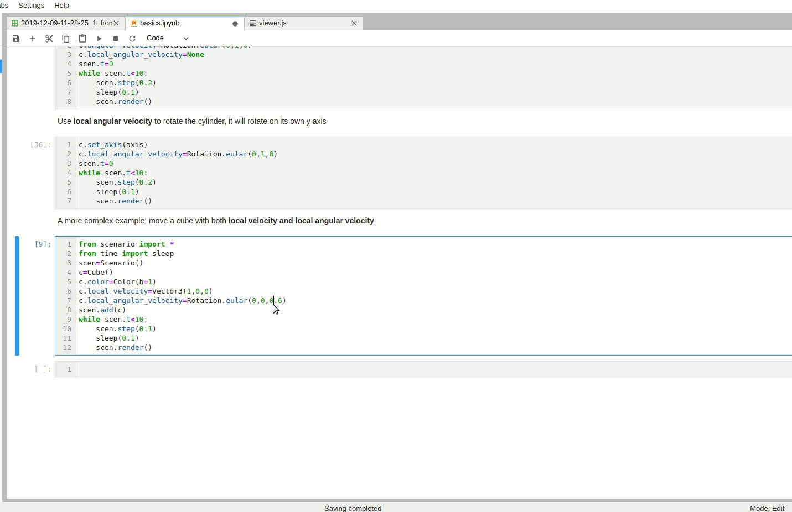

**Scenario** is a python library that helps to build simple environments for simulation of agents.

# Features
☐ Simple 3d physics engine\
☑ Tiny 2D rendering, view from top\
☑ Smooth 3D rendering\
☑ No ipc in simulation loop, python environment\
☐ python agent or C++ agent. Providing APIs to include C++ agent as a python libary\
☑ Simulation without rendering\
☑ Apis to handle transforms: translation, rotation and scaling\
☑ Apis to handle quaternion, axis-angle, and eular angles

**Example 1**: a dynamic spiral line
```python
from scenario import *
from time import sleep
from math import sin,cos
scen=Scenario()
l=Line()
l.line_width=2
l.color=Color(r=1,b=1)
l.is_arrow=True
l.width=2
scen.add(l)
while scen.t<10:
    x=sin(5*scen.t)*scen.t
    y=cos(5*scen.t)*scen.t
    z=scen.t
    l.points.append([x,y,z])
    scen.step(0.01)
    scen.render()
    sleep(0.01)
```


**Example 2**: move a cube by setting **local velocity** and **local angular velocity**
```python
from scenario import *
from time import sleep
scen=Scenario()
c=Cube()
c.color=Color(b=1)
c.local_velocity=Vector3(1,0,0)
c.local_angular_velocity=Rotation.eular(0,0,0.6)
scen.add(c)
while scen.t<10:
    scen.step(0.1)
    scen.render()
    sleep(0.1)
```


[Here](doc/basics.ipynb) is an introduction to Scenario, read it for details.

# Target Users
* Students or engineers who want to test their algrithms in cases
* For small companies
* For unit test
* For proto design